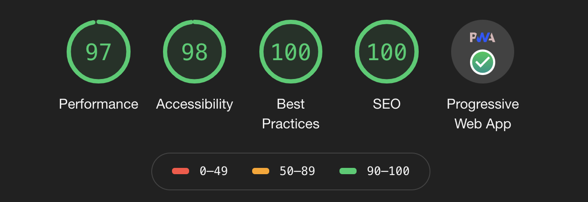

# Matt Rigg Portfolio

Website: [mattrigg.dev](https://mattrigg.dev)

## Introduction
This is the repo of my own personal portfolio of work. I always enjoy looking around the corner and experimenting with new platforms and frameworks for new use cases. This project represents my venture into static site generation using [GatsbyJS](https://www.gatsbyjs.org/).

## Infrastructure
This site is hosted with an AWS infrastructure of S3 fronted by CloudFront via OAI. The stack is managed via an instance of a generic CDK stack that I created [here](https://github.com/mattrigg9/cdk-s3-distribution-template).

## Lighthouse Report Card
By implementing accessibility best practices, optimized, client-aware asset delivery, and best PWA practices, I was able to achieve a strong Lighthouse audit score:



## Package Management
### Start Server in Development Mode
```
npm run develop
```


### Clean and Build Package
```
npm run build
```

### Deploy built package to S3 and invalidate CloudFront distribution
```
npm run deploy
```

